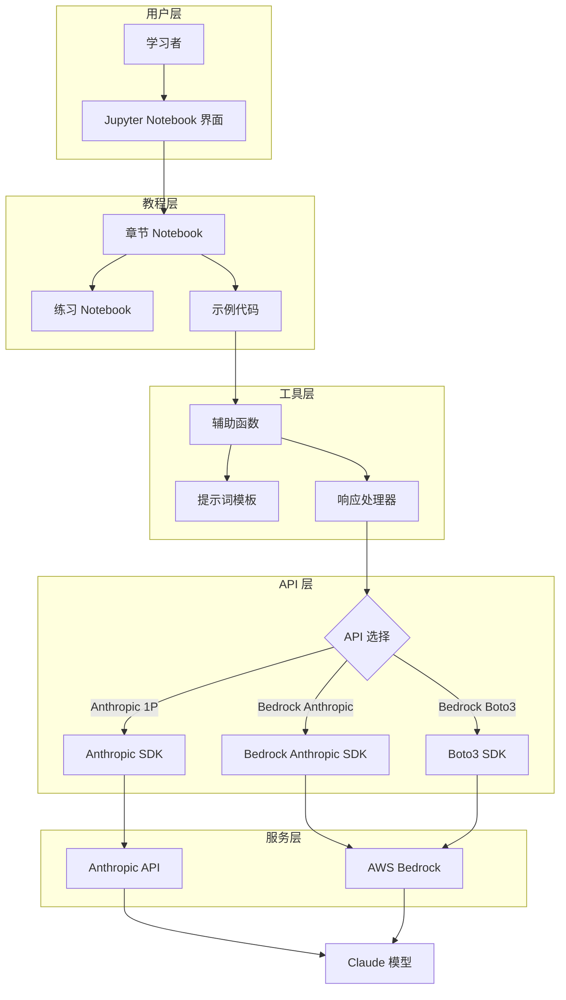
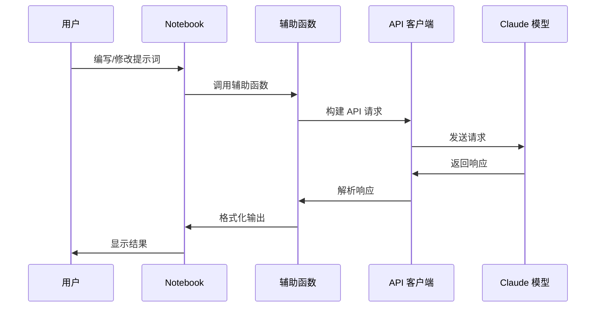
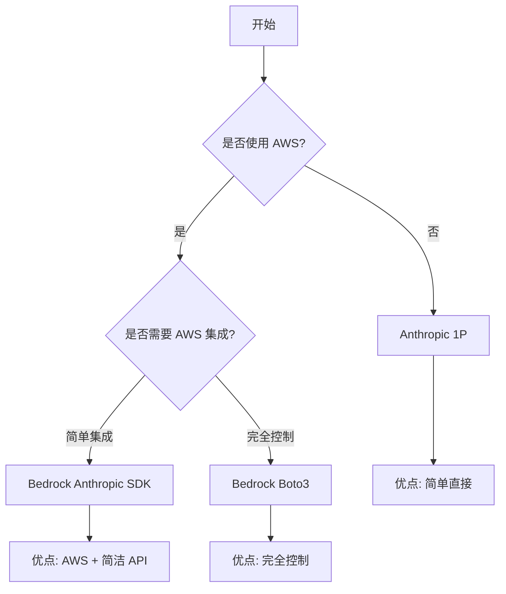

# 架构设计文档

## 目录

- [概述](#概述)
- [系统架构](#系统架构)
- [核心组件](#核心组件)
- [设计模式](#设计模式)
- [数据流](#数据流)
- [版本架构差异](#版本架构差异)
- [扩展性设计](#扩展性设计)
- [相关资源](#相关资源)

## 概述

本文档描述 Anthropic Claude 提示工程交互式教程项目的整体架构设计。该项目是一个基于 Jupyter Notebook 的交互式学习平台，旨在帮助开发者掌握 Claude 提示工程的最佳实践。

### 设计目标

- **教学优先**：以教学效果为核心，提供循序渐进的学习体验
- **交互性强**：通过 Jupyter Notebook 实现即时反馈和实验
- **多版本支持**：支持 Anthropic 1P API 和 AWS Bedrock 两种部署方式
- **易于扩展**：模块化设计，便于添加新章节和练习
- **代码简洁**：保持示例代码的简洁性和可读性

### 技术栈

- **编程语言**：Python 3.7+
- **交互环境**：Jupyter Notebook / JupyterLab
- **API 客户端**：
  - Anthropic Python SDK (`anthropic`)
  - AWS Boto3 SDK (`boto3`)
- **文档格式**：Markdown

## 系统架构

### 整体架构图



### 架构层次说明

1. **用户层**：学习者通过 Jupyter Notebook 界面与教程交互
2. **教程层**：包含章节内容、练习和示例代码
3. **工具层**：提供辅助函数、模板和响应处理功能
4. **API 层**：抽象不同的 API 实现方式
5. **服务层**：实际的 Claude 模型服务

## 核心组件

### 1. Notebook 教程模块

**职责**：提供交互式学习内容

**组成**：
- **章节 Notebook**：包含理论讲解、示例演示和概念说明
- **练习 Notebook**：提供实践练习和答案验证
- **示例练习场**：允许学习者自由实验和修改提示词

**特点**：
- 每个 Notebook 独立运行
- 包含完整的代码示例
- 提供即时反馈机制

### 2. API 客户端模块

**职责**：封装与 Claude 模型的交互

**实现方式**：

#### Anthropic 1P 版本
```python
from anthropic import Anthropic

client = Anthropic(api_key="your-api-key")
message = client.messages.create(
    model="claude-3-haiku-20240307",
    max_tokens=1024,
    messages=[
        {"role": "user", "content": "Hello, Claude"}
    ]
)
```

#### Bedrock Anthropic SDK 版本
```python
from anthropic import AnthropicBedrock

client = AnthropicBedrock(
    aws_region="us-east-1"
)
message = client.messages.create(
    model="anthropic.claude-3-haiku-20240307-v1:0",
    max_tokens=1024,
    messages=[
        {"role": "user", "content": "Hello, Claude"}
    ]
)
```

#### Bedrock Boto3 版本
```python
import boto3
import json

bedrock = boto3.client(
    service_name='bedrock-runtime',
    region_name='us-east-1'
)

body = json.dumps({
    "anthropic_version": "bedrock-2023-05-31",
    "max_tokens": 1024,
    "messages": [
        {"role": "user", "content": "Hello, Claude"}
    ]
})

response = bedrock.invoke_model(
    modelId='anthropic.claude-3-haiku-20240307-v1:0',
    body=body
)
```

### 3. 辅助工具模块

**职责**：提供通用的辅助功能

**位置**：`utils/` 目录

**功能**：
- **hints.py**：提供练习提示和答案验证
- **响应格式化**：统一处理和显示 API 响应
- **错误处理**：捕获和友好显示错误信息

**示例**：
```python
# utils/hints.py
def get_hint(exercise_number):
    """获取练习提示"""
    hints = {
        1: "尝试使用更清晰的指令...",
        2: "考虑添加角色定义...",
        # ...
    }
    return hints.get(exercise_number, "暂无提示")

def check_answer(user_prompt, expected_pattern):
    """检查答案是否符合预期"""
    # 验证逻辑
    pass
```

### 4. 配置管理模块

**职责**：管理 API 密钥和环境配置

**实现方式**：
- 使用环境变量存储敏感信息
- 支持配置文件（可选）
- 提供配置验证功能

**示例**：
```python
import os

# Anthropic 1P
ANTHROPIC_API_KEY = os.environ.get("ANTHROPIC_API_KEY")

# AWS Bedrock
AWS_REGION = os.environ.get("AWS_REGION", "us-east-1")
AWS_ACCESS_KEY_ID = os.environ.get("AWS_ACCESS_KEY_ID")
AWS_SECRET_ACCESS_KEY = os.environ.get("AWS_SECRET_ACCESS_KEY")
```

## 设计模式

### 1. 模板方法模式

**应用场景**：章节 Notebook 结构

每个章节 Notebook 遵循统一的结构模板：

```
1. 章节标题和学习目标
2. 概念介绍
3. 示例演示
4. 最佳实践说明
5. 常见错误示例
6. 示例练习场
7. 练习题
```

### 2. 策略模式

**应用场景**：多 API 版本支持

通过策略模式支持不同的 API 实现：

```python
class APIStrategy:
    def send_message(self, prompt, **kwargs):
        raise NotImplementedError

class AnthropicStrategy(APIStrategy):
    def send_message(self, prompt, **kwargs):
        # Anthropic 1P 实现
        pass

class BedrockStrategy(APIStrategy):
    def send_message(self, prompt, **kwargs):
        # Bedrock 实现
        pass
```

### 3. 装饰器模式

**应用场景**：错误处理和日志记录

```python
def handle_api_errors(func):
    """装饰器：统一处理 API 错误"""
    def wrapper(*args, **kwargs):
        try:
            return func(*args, **kwargs)
        except Exception as e:
            print(f"API 调用失败: {str(e)}")
            return None
    return wrapper

@handle_api_errors
def call_claude(prompt):
    # API 调用逻辑
    pass
```

## 数据流

### 典型交互流程



### 数据流说明

1. **输入阶段**：用户在 Notebook 中编写提示词
2. **预处理阶段**：辅助函数验证和格式化输入
3. **请求阶段**：API 客户端构建并发送请求
4. **处理阶段**：Claude 模型处理请求并生成响应
5. **响应阶段**：解析和格式化响应内容
6. **输出阶段**：在 Notebook 中展示结果

## 版本架构差异

### 三个版本对比

| 特性 | Anthropic 1P | Bedrock Anthropic SDK | Bedrock Boto3 |
|------|--------------|----------------------|---------------|
| **API 客户端** | `anthropic` | `anthropic` (Bedrock) | `boto3` |
| **认证方式** | API Key | AWS 凭证 | AWS 凭证 |
| **模型 ID** | `claude-3-haiku-20240307` | `anthropic.claude-3-haiku-20240307-v1:0` | 同左 |
| **请求格式** | 原生 Anthropic | 原生 Anthropic | JSON 封装 |
| **响应格式** | 原生对象 | 原生对象 | JSON 响应 |
| **适用场景** | 直接使用 Anthropic | AWS 环境 + 简洁 API | AWS 环境 + 完全控制 |

### 版本选择决策树



### 版本特定架构

#### Anthropic 1P 架构
```
Notebook → Anthropic SDK → Anthropic API → Claude
```

#### Bedrock 架构
```
Notebook → SDK/Boto3 → AWS Bedrock → Claude
                ↓
           AWS IAM 认证
```

## 扩展性设计

### 1. 添加新章节

**步骤**：
1. 复制章节模板 Notebook
2. 填充教学内容和示例
3. 创建对应的练习 Notebook
4. 更新主 README 的目录

**模板结构**：
```python
# 章节标题
## 学习目标
## 概念介绍
## 示例演示
## 最佳实践
## 示例练习场
## 练习题
```

### 2. 支持新模型

**修改点**：
- 更新模型 ID 配置
- 调整 `max_tokens` 等参数
- 更新文档说明

**示例**：
```python
# 支持 Claude 3 Opus
MODEL_CONFIG = {
    "haiku": "claude-3-haiku-20240307",
    "sonnet": "claude-3-sonnet-20240229",
    "opus": "claude-3-opus-20240229"
}
```

### 3. 添加新功能

**可扩展功能**：
- 提示词模板库
- 自动评分系统
- 进度跟踪
- 协作学习功能

### 4. 国际化支持

**架构考虑**：
- 分离内容和代码
- 使用 i18n 目录结构
- 支持多语言切换

```
notebooks/
├── en/          # 英文版本
├── zh/          # 中文版本
└── ja/          # 日文版本（未来）
```

## 性能考虑

### 1. API 调用优化

- **批量处理**：支持批量提示词评估
- **缓存机制**：缓存常见响应
- **超时控制**：设置合理的超时时间
- **重试策略**：实现指数退避重试

### 2. Notebook 性能

- **延迟加载**：大型示例延迟执行
- **输出限制**：限制长响应的显示长度
- **内存管理**：及时清理不需要的变量

### 3. 成本优化

- **模型选择**：默认使用 Haiku（最经济）
- **Token 控制**：限制 `max_tokens` 参数
- **请求优化**：避免不必要的 API 调用

## 安全考虑

### 1. 凭证管理

- **环境变量**：使用环境变量存储 API 密钥
- **不提交密钥**：`.gitignore` 排除配置文件
- **密钥轮换**：定期更新 API 密钥

### 2. 输入验证

- **提示词长度**：限制输入长度
- **内容过滤**：检测和拒绝恶意输入
- **注入防护**：防止提示词注入攻击

### 3. 输出安全

- **内容审核**：检查响应内容
- **敏感信息**：避免泄露敏感数据
- **错误处理**：不暴露内部错误详情

## 相关资源

### 架构参考

- [Anthropic API 文档](https://docs.anthropic.com/)
- [AWS Bedrock 架构](https://docs.aws.amazon.com/bedrock/)
- [Jupyter 架构指南](https://jupyter.org/documentation)

### 设计模式

- [Python 设计模式](https://refactoring.guru/design-patterns/python)
- [API 设计最佳实践](https://swagger.io/resources/articles/best-practices-in-api-design/)

### 下一步

- [开发指南](development-guide.md) - 了解如何搭建开发环境
- [贡献指南](contributing.md) - 了解如何为项目做贡献
- [代码规范](code-style.md) - 了解代码风格要求

---

**最后更新**：2024-12-02  
**维护者**：项目团队
