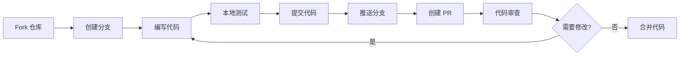

# 贡献指南

## 目录

- [欢迎贡献](#欢迎贡献)
- [贡献方式](#贡献方式)
- [开始之前](#开始之前)
- [报告问题](#报告问题)
- [提交代码](#提交代码)
- [Pull Request 流程](#pull-request-流程)
- [代码审查](#代码审查)
- [贡献者行为准则](#贡献者行为准则)
- [许可证](#许可证)
- [获取帮助](#获取帮助)

## 欢迎贡献

感谢您对本项目的关注！无论是报告 bug、提出新功能建议、改进文档，还是提交代码，我们都非常欢迎并感激来自社区的反馈和贡献。

### 我们需要什么样的贡献

- 🐛 **Bug 修复**：发现并修复项目中的错误
- ✨ **新功能**：添加新的章节、练习或功能
- 📝 **文档改进**：完善文档、修正错别字、添加示例
- 🌍 **国际化**：翻译文档和教程内容
- 🎨 **用户体验**：改进 Notebook 界面和交互体验
- 🧪 **测试**：添加测试用例，提高代码质量
- 💡 **建议**：提出改进项目的想法

## 贡献方式

### 1. 报告 Bug 或提出功能请求

使用 GitHub Issue 跟踪器报告问题或建议新功能。

### 2. 改进文档

文档改进不需要编写代码，是很好的入门贡献方式。

### 3. 提交代码

通过 Pull Request 提交代码改进或新功能。

### 4. 参与讨论

在 Issue 和 Pull Request 中参与技术讨论，帮助其他贡献者。

### 5. 推广项目

分享项目，帮助更多人了解和使用。

## 开始之前

### 1. 阅读文档

在开始贡献之前，请先阅读以下文档：

- [README.md](../../../README.md) - 项目概述
- [开发指南](development-guide.md) - 环境搭建
- [架构设计](architecture.md) - 项目架构
- [代码规范](code-style.md) - 编码标准

### 2. 搭建开发环境

按照[开发指南](development-guide.md)搭建本地开发环境。

### 3. 了解项目结构

熟悉项目的目录结构和核心组件。

### 4. 查看现有 Issue

查看 [GitHub Issues](https://github.com/anthropics/prompt-eng-interactive-tutorial/issues) 了解当前的问题和需求。

## 报告问题

### Bug 报告

发现 bug 时，请使用 GitHub Issue 跟踪器报告。在提交之前：

1. **搜索现有 Issue**：确保问题尚未被报告
2. **检查最新版本**：确认问题在最新版本中仍然存在
3. **收集信息**：准备详细的问题描述

#### Bug 报告模板

```markdown
**问题描述**
简要描述遇到的问题。

**复现步骤**
1. 打开 '...'
2. 点击 '...'
3. 滚动到 '...'
4. 看到错误

**预期行为**
描述您期望发生什么。

**实际行为**
描述实际发生了什么。

**截图**
如果适用，添加截图帮助说明问题。

**环境信息**
- 操作系统：[例如 macOS 13.0]
- Python 版本：[例如 3.9.7]
- 项目版本：[例如 Anthropic 1P / Bedrock]
- 浏览器：[例如 Chrome 120]

**错误日志**
```
粘贴相关的错误信息或日志
```

**附加信息**
其他有助于理解问题的信息。
```

### 功能请求

提出新功能建议时，请说明：

1. **功能描述**：清晰描述建议的功能
2. **使用场景**：说明为什么需要这个功能
3. **预期效果**：描述功能应该如何工作
4. **替代方案**：是否考虑过其他解决方案

#### 功能请求模板

```markdown
**功能描述**
简要描述建议的功能。

**问题背景**
这个功能解决什么问题？为什么需要它？

**建议方案**
详细描述功能应该如何工作。

**替代方案**
是否考虑过其他实现方式？

**附加信息**
其他相关信息、示例或参考资料。
```

## 提交代码

### 工作流程



### 详细步骤

#### 1. Fork 仓库

在 GitHub 上 Fork 项目仓库到您的账户。

#### 2. 克隆仓库

```bash
# 克隆您 Fork 的仓库
git clone https://github.com/YOUR-USERNAME/prompt-eng-interactive-tutorial.git
cd prompt-eng-interactive-tutorial

# 添加上游仓库
git remote add upstream https://github.com/anthropics/prompt-eng-interactive-tutorial.git
```

#### 3. 创建分支

```bash
# 确保在最新的 main 分支
git checkout main
git pull upstream main

# 创建新分支
git checkout -b feature/your-feature-name
```

**分支命名规范**：
- `feature/功能名称` - 新功能
- `fix/问题描述` - Bug 修复
- `docs/文档主题` - 文档更新
- `refactor/重构内容` - 代码重构
- `test/测试内容` - 测试相关

#### 4. 编写代码

- 遵循[代码规范](code-style.md)
- 保持代码简洁清晰
- 添加必要的注释
- 确保代码可以正常运行

#### 5. 测试代码

```bash
# 运行相关的 Notebook
jupyter notebook your-notebook.ipynb

# 测试所有单元格
# Cell > Run All

# 验证输出正确
```

#### 6. 提交代码

```bash
# 查看修改
git status
git diff

# 添加文件
git add .

# 提交（使用规范的提交信息）
git commit -m "feat: 添加新章节 - 高级提示技巧"
```

**提交信息规范**：

格式：`<类型>: <简短描述>`

类型：
- `feat`: 新功能
- `fix`: Bug 修复
- `docs`: 文档更新
- `style`: 代码格式调整（不影响功能）
- `refactor`: 代码重构
- `test`: 测试相关
- `chore`: 构建/工具相关

示例：
```bash
git commit -m "feat: 添加工具使用章节"
git commit -m "fix: 修复 API 密钥验证问题"
git commit -m "docs: 更新安装指南"
```

#### 7. 推送分支

```bash
# 推送到您的 Fork
git push origin feature/your-feature-name
```

#### 8. 创建 Pull Request

1. 访问您 Fork 的仓库页面
2. 点击 "Compare & pull request" 按钮
3. 填写 PR 描述（见下方模板）
4. 提交 Pull Request

## Pull Request 流程

### PR 描述模板

```markdown
## 变更说明

简要描述这个 PR 做了什么。

## 变更类型

- [ ] Bug 修复
- [ ] 新功能
- [ ] 文档更新
- [ ] 代码重构
- [ ] 性能优化
- [ ] 其他（请说明）

## 相关 Issue

关闭 #issue_number（如果适用）

## 测试

描述如何测试这些变更：
- [ ] 已在本地测试
- [ ] 所有 Notebook 单元格正常运行
- [ ] 文档链接有效
- [ ] 代码符合规范

## 截图（如果适用）

添加截图展示变更效果。

## 检查清单

- [ ] 代码遵循项目的代码规范
- [ ] 已进行自我审查
- [ ] 代码有适当的注释
- [ ] 文档已更新
- [ ] 变更不会产生新的警告
- [ ] 已添加必要的测试
- [ ] 所有测试通过

## 附加信息

其他需要审查者知道的信息。
```

### PR 审查流程

1. **自动检查**：CI/CD 自动运行检查（如果配置）
2. **代码审查**：维护者审查代码
3. **讨论修改**：根据反馈进行讨论和修改
4. **批准合并**：审查通过后合并到主分支

### 响应审查意见

```bash
# 根据反馈修改代码
# ...

# 提交修改
git add .
git commit -m "fix: 根据审查意见修改代码"

# 推送更新
git push origin feature/your-feature-name
```

PR 会自动更新，无需创建新的 PR。

## 代码审查

### 审查标准

代码审查时，我们关注：

1. **功能正确性**：代码是否正确实现了预期功能
2. **代码质量**：代码是否清晰、简洁、易于维护
3. **规范遵循**：是否遵循项目的代码规范
4. **文档完整性**：是否有适当的注释和文档
5. **测试覆盖**：是否有足够的测试
6. **性能影响**：是否对性能有负面影响
7. **安全性**：是否存在安全隐患

### 审查礼仪

**作为审查者**：
- 保持友好和建设性
- 解释为什么需要修改
- 提供具体的改进建议
- 认可好的代码

**作为贡献者**：
- 开放接受反馈
- 及时响应审查意见
- 不要把批评当作针对个人
- 感谢审查者的时间和建议


## 贡献者行为准则

### 我们的承诺

为了营造开放和友好的环境，我们作为贡献者和维护者承诺：无论年龄、体型、残疾、族裔、性别认同和表达、经验水平、国籍、个人外貌、种族、宗教或性取向如何，参与我们的项目和社区的每个人都不会受到骚扰。

### 我们的标准

有助于创造积极环境的行为包括：

- ✅ 使用友好和包容的语言
- ✅ 尊重不同的观点和经验
- ✅ 优雅地接受建设性批评
- ✅ 关注对社区最有利的事情
- ✅ 对其他社区成员表示同理心

不可接受的行为包括：

- ❌ 使用性化的语言或图像，以及不受欢迎的性关注或挑逗
- ❌ 挑衅、侮辱/贬损性评论，以及人身或政治攻击
- ❌ 公开或私下骚扰
- ❌ 未经明确许可，发布他人的私人信息（如物理地址或电子地址）
- ❌ 在专业环境中可能被合理认为不适当的其他行为

### 我们的责任

项目维护者负责阐明可接受行为的标准，并应对任何不可接受的行为采取适当和公平的纠正措施。

项目维护者有权利和责任删除、编辑或拒绝与本行为准则不符的评论、提交、代码、wiki 编辑、问题和其他贡献，或暂时或永久禁止任何他们认为有不适当、威胁、冒犯或有害行为的贡献者。

### 适用范围

本行为准则适用于项目空间和公共空间，当个人代表项目或其社区时。代表项目或社区的示例包括使用官方项目电子邮件地址、通过官方社交媒体账户发布内容，或在线上或线下活动中担任指定代表。

### 执行

可以通过 opensource-codeofconduct@amazon.com 联系项目团队来报告辱骂、骚扰或其他不可接受的行为。所有投诉都将被审查和调查，并将做出被认为必要和适当的回应。项目团队有义务对事件报告者保密。

本行为准则改编自 [Amazon Open Source Code of Conduct](https://aws.github.io/code-of-conduct)。

## 安全问题报告

如果您在本项目中发现潜在的安全问题，请通过 [AWS 安全漏洞报告页面](http://aws.amazon.com/security/vulnerability-reporting/) 通知 AWS/Amazon 安全团队。**请勿**创建公开的 GitHub Issue。

### 报告内容应包括

- 问题描述
- 复现步骤
- 潜在影响
- 建议的修复方案（如果有）

## 许可证

通过为本项目做贡献，您同意您的贡献将按照项目的许可证进行授权。

请查看 [LICENSE](../../../LICENSE) 文件了解详情。我们会要求您确认贡献的许可。

### 贡献者许可协议（CLA）

在您的 Pull Request 被接受之前，您可能需要签署贡献者许可协议（CLA）。这是一次性的过程，会在您首次提交 PR 时自动触发。

## 贡献认可

### 贡献者名单

我们感谢所有为项目做出贡献的人！贡献者将被列在项目的贡献者页面。

### 贡献类型

我们认可各种形式的贡献：

- 💻 **代码**：提交代码改进
- 📖 **文档**：改进文档
- 🐛 **Bug 报告**：发现并报告问题
- 💡 **想法**：提出新功能建议
- 🤔 **问答**：帮助其他用户
- 🌍 **翻译**：翻译文档和内容
- 👀 **审查**：审查 Pull Request

## 常见问题

### 我是新手，可以贡献吗？

当然可以！我们欢迎所有级别的贡献者。可以从以下方面开始：

- 修正文档中的错别字
- 改进文档说明
- 添加代码注释
- 报告 bug
- 参与讨论

查找标记为 `good first issue` 或 `help wanted` 的 Issue。

### 我不会编程，可以贡献吗？

可以！非代码贡献同样重要：

- 改进文档
- 翻译内容
- 报告 bug
- 提出功能建议
- 帮助其他用户
- 推广项目

### 我的 PR 多久会被审查？

我们尽力在 1-2 周内审查 PR。如果您的 PR 长时间未被审查，可以：

- 在 PR 中添加评论提醒
- 在相关 Issue 中提及
- 联系维护者

### 我的 PR 被拒绝了怎么办？

不要灰心！被拒绝的原因可能是：

- 不符合项目方向
- 需要更多讨论
- 实现方式需要改进

您可以：

- 询问拒绝原因
- 根据反馈改进
- 在 Issue 中继续讨论

### 如何成为维护者？

活跃的贡献者可能会被邀请成为维护者。维护者需要：

- 持续高质量的贡献
- 帮助审查其他人的 PR
- 参与项目决策讨论
- 遵守行为准则

## 贡献指南

### 文档贡献

#### 改进现有文档

1. 找到需要改进的文档
2. 创建分支：`git checkout -b docs/improve-installation-guide`
3. 编辑文档
4. 提交：`git commit -m "docs: 改进安装指南的 Windows 说明"`
5. 创建 PR

#### 添加新文档

1. 参考 `docs/zh/templates/` 中的模板
2. 创建新文档文件
3. 更新相关的导航链接
4. 提交 PR

### 代码贡献

#### 添加新章节

1. 复制现有章节 Notebook 作为模板
2. 修改内容：
   - 更新标题和学习目标
   - 添加概念介绍
   - 编写示例代码
   - 创建练习题
3. 测试所有代码单元格
4. 更新 README 目录
5. 提交 PR

#### 修复 Bug

1. 在 Issue 中确认 bug
2. 创建分支：`git checkout -b fix/api-key-validation`
3. 修复问题
4. 测试修复
5. 提交 PR，引用相关 Issue

#### 添加新功能

1. 在 Issue 中讨论功能
2. 获得维护者同意
3. 创建分支
4. 实现功能
5. 添加文档
6. 测试功能
7. 提交 PR

### 翻译贡献

#### 翻译文档

1. 选择要翻译的文档
2. 创建分支：`git checkout -b i18n/translate-to-japanese`
3. 翻译内容：
   - 保持格式一致
   - 使用术语表中的标准术语
   - 保留代码示例不变
4. 请母语者审查
5. 提交 PR

#### 翻译 Notebook

1. 复制英文 Notebook
2. 翻译文本单元格
3. 保持代码单元格不变
4. 测试所有单元格
5. 提交 PR

## 开发最佳实践

### 1. 保持小而专注的 PR

- 每个 PR 只解决一个问题
- 避免在一个 PR 中混合多个不相关的改动
- 大功能可以拆分成多个 PR

### 2. 编写清晰的提交信息

```bash
# 好的提交信息
git commit -m "feat: 添加 Claude 3 Opus 支持"
git commit -m "fix: 修复 Bedrock 认证错误"
git commit -m "docs: 更新 API 配置说明"

# 不好的提交信息
git commit -m "update"
git commit -m "fix bug"
git commit -m "changes"
```

### 3. 及时同步上游

```bash
# 定期同步上游更新
git fetch upstream
git checkout main
git merge upstream/main
git push origin main
```

### 4. 保持代码整洁

- 删除调试代码
- 移除未使用的导入
- 格式化代码
- 添加必要的注释

### 5. 测试充分

- 测试正常情况
- 测试边界情况
- 测试错误处理
- 在不同环境测试

## 获取帮助

### 资源

- **文档**：查看 [docs/zh/](../../../docs/zh/) 目录
- **示例**：参考现有的 Notebook
- **Issue**：搜索或创建 Issue
- **讨论**：参与 GitHub Discussions

### 联系方式

- **GitHub Issues**：技术问题和 bug 报告
- **Pull Requests**：代码审查和讨论
- **Email**：opensource-codeofconduct@amazon.com（行为准则相关）

### 相关文档

- [开发指南](development-guide.md) - 环境搭建和开发流程
- [架构设计](architecture.md) - 项目架构说明
- [代码规范](code-style.md) - 编码标准和最佳实践

---

**感谢您的贡献！** 🎉

每一个贡献，无论大小，都让这个项目变得更好。我们期待与您合作！

---

**最后更新**：2024-12-02  
**维护者**：项目团队
